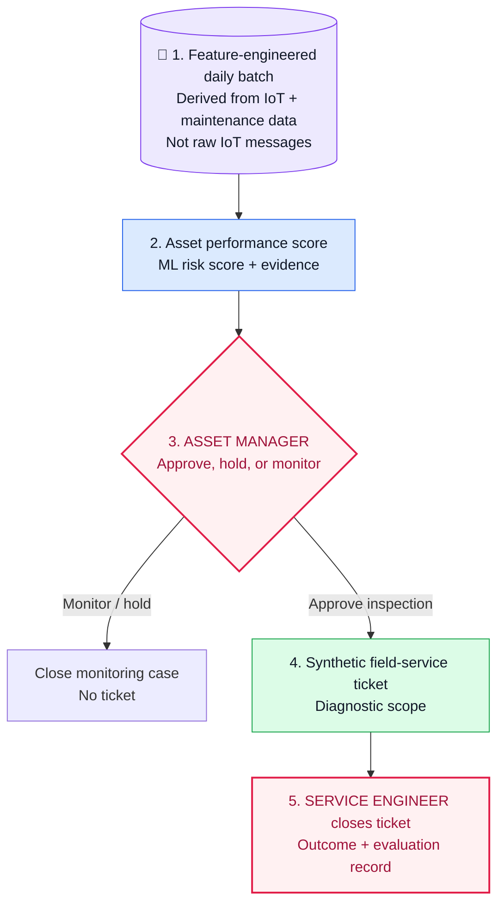

# Industrial Agentic AI POC — Operations Intelligence

**A runnable, synthetic POC for turning early ESP risk signals into a governed field-service response.**

## 1. Executive Summary

Industrial operations are a classic Industry 4.0 OT/IT transformation problem: high-volume operational telemetry lives alongside production, maintenance, and field-service information, but decisions still depend on fragmented evidence and manual coordination.

This POC demonstrates a modern AI pattern for that environment: convert raw OT signals into a governed feature set, apply a purpose-built ML model, and route the resulting evidence through a human-approved operational workflow. It is not a generic chatbot and it does not automate equipment control.

## 2. Use Case Overview — Early ESP Risk to Field Response

At the end of each production day, the system scores each active ESP-lifted well. A high-risk signal gives the Asset Manager evidence to review. Only an approved inspection creates a synthetic field ticket; the Service Engineer's outcome closes the case and becomes evaluation evidence.

| Synthetic well | Workflow result |
|---|---|
| `WELL-025` | Stable pattern → `monitor` → case closes; no ticket |
| `WELL-024` | High risk → human approval → synthetic ticket → outcome record |

## 3. Data Gathering and Feature Engineering

The model receives a governed, feature-engineered daily batch—not raw IoT messages. Raw telemetry is frequent and narrow; the daily batch creates one coherent view of one well, one observation date, and its recent operating history.

| Raw OT / IT input | Example | Feature-engineered daily batch | Why it is useful |
|---|---|---|---|
| ESP motor-current readings | `WELL-024 · 10:05 · 61.8 A` | `motor_current_cv_7d_pct: 10.5` | Captures instability over time, not one reading |
| Production readings | `WELL-024 · 10:05 · 420 BPD` | `oil_rate_decline_30d_pct: 19.2` | Captures deterioration trend |
| Pump-intake-pressure readings | `WELL-024 · 10:05 · 920 PSI` | `intake_pressure_decline_30d_pct: 14.8` | Captures hydraulic trend |
| Alarm and maintenance history | Alarm events and last intervention date | `alarm_count_30d: 4` and `days_since_last_intervention: 418` | Adds operating and maintenance context |

For model development, the POC uses synthetic historical data with a chronological train / validation / test split. For daily scoring, it uses an unlabeled feature pack for the active well.

## 4. Machine Learning Approach

This is a supervised classification problem: predict whether a well has elevated risk of an ESP-related intervention or material production-loss event in the next 30 days. The lab compares an operating-rule baseline, logistic regression, and gradient-boosted trees; validation selects the model and threshold, and a held-out test set evaluates the final candidate.

The output is a risk score, tier, and visible supporting signals—not a root-cause diagnosis. [See the runnable ML Lab.](ml/README.md)

## 5. End-to-End Solution Workflow

The model is only the first step. The workflow preserves the same `case_id` through scoring, human approval, synthetic ticket creation, field closure, and evaluation. The formal skills define each handoff; the local state-machine runner makes the workflow repeatable for both high-risk and healthy cases.

- [Workflow implementation and skill mapping](WORKFLOW.md)
- [Runnable workflow state machine](src/workflow_runner.py)

## POC boundary

All data, scores, tickets, approvals, and field outcomes are synthetic. This POC does not connect to live OT equipment or a CMMS, dispatch technicians, purchase equipment, change operating settings, or make safety decisions.

The broader upstream trial scope and assumptions are in [`trial-scope/`](trial-scope/README.md). Use-case selection and client-specific economic impact belong in a separate customer trial-scoping deck, not in this reusable POC.
