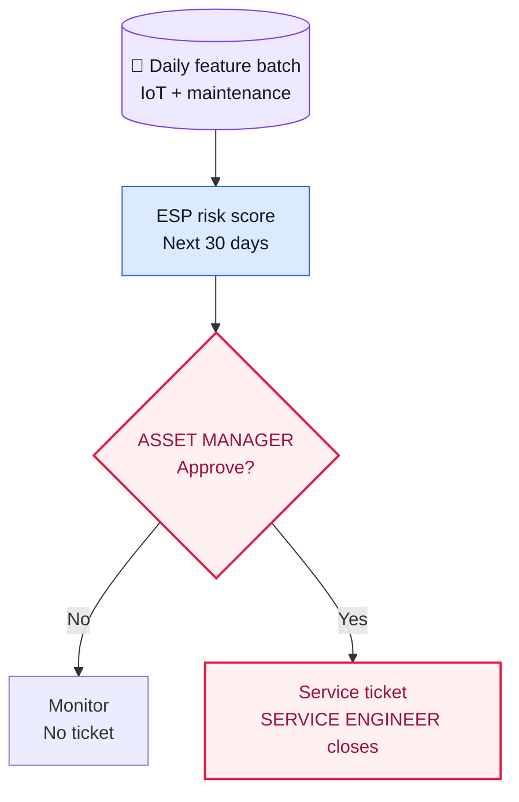
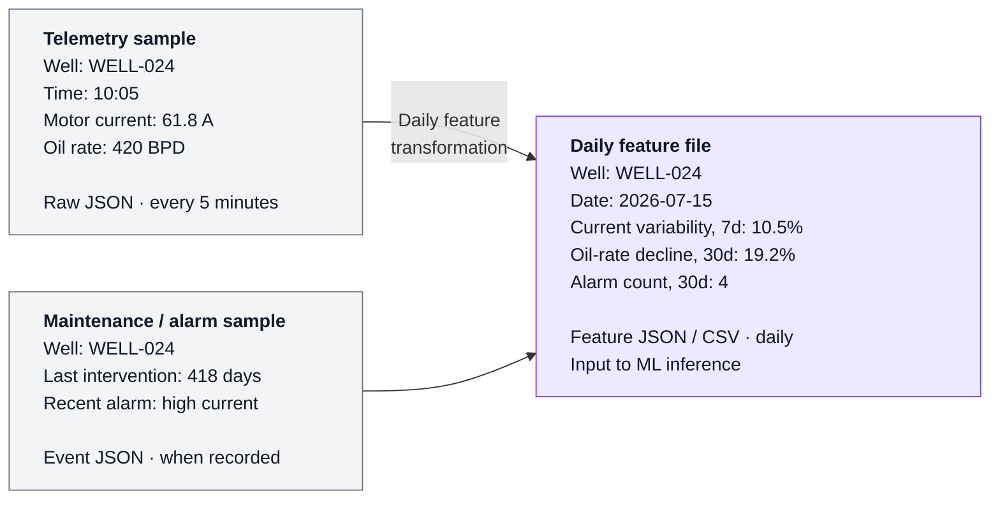
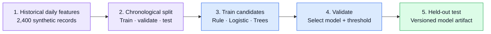
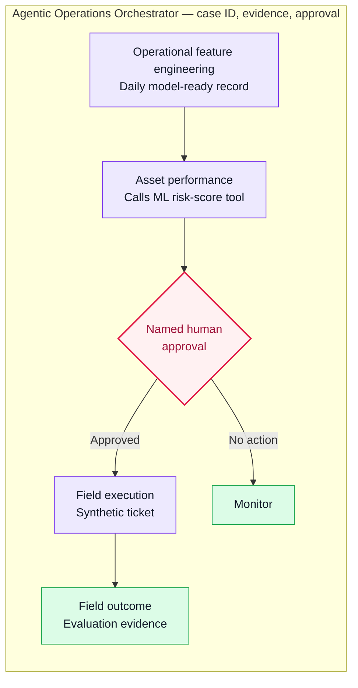

# Industrial Agentic AI POC — Operations Intelligence

**A runnable, synthetic POC for turning early ESP risk signals into a governed field-service response.**

## 1. Executive Summary

Industrial operations are a classic Industry 4.0 OT/IT transformation problem: high-volume operational telemetry lives alongside production, maintenance, and field-service information, but decisions still depend on fragmented evidence and manual coordination.

This public POC uses synthetic data to demonstrate a modern AI pattern for that environment: convert raw OT signals into a governed feature set, apply a purpose-built ML model, and route the resulting evidence through a human-approved operational workflow. It provides decision support—not a generic chatbot, live equipment control, or field execution.

## 2. Use Case Overview — Early ESP Risk to Field Response

This use case is for **upstream oil production / extraction**, not exploration. An electric submersible pump (ESP) lifts produced fluids from a well; deteriorating pump performance can lead to avoidable production loss and an expensive field intervention.

- **Predict:** At the end of each production day, score each active ESP-lifted well for elevated 30-day ESP-related production-loss or intervention risk.
- **Decide:** Give the Asset Manager the score and supporting signals for review; the model does not diagnose root cause or control equipment.
- **Respond:** Only an approved inspection creates a field-service ticket. The Service Engineer closes the ticket with the field outcome, which becomes evaluation evidence.

## 3. Data Gathering and Feature Engineering

The model does **not** receive raw IoT messages. It receives one daily, feature-engineered record per well.

The left side is a stream of narrow operational events. The right side is the single daily record passed to inference: it combines current readings, recent variability, longer-term trends, alarms, and maintenance context.

For model development, the POC uses synthetic historical daily records with a chronological train / validation / test split. For daily scoring, the record is unlabeled because the next 30-day outcome has not happened yet.

The source-to-feature contract is defined in the [operational-feature-engineering skill](.agents/skills/operational-feature-engineering/SKILL.md).

## 4. Machine Learning Approach

This is a supervised classification problem: predict whether a well has elevated risk of an ESP-related intervention or material production-loss event in the next 30 days.

- **Offline training — completed:** The lab generates 2,400 synthetic historical daily records, splits them chronologically into train / validation / test sets, and compares an operating-rule baseline, logistic regression, and gradient-boosted trees. Validation selects the logistic-regression model and decision threshold; a held-out test set completes the final check.
- **Reusable artifact:** Training produces a versioned `esp_risk_model.joblib` file plus compact evaluation reports. The model is interpretable and intentionally small for this POC; the same service boundary can later host a different validated model.

The output is a risk score, tier, and visible supporting signals—not a root-cause diagnosis. [See the runnable ML Lab.](ml/README.md)

## 5. End-to-End Solution Workflow

The trained model is only the first step.

- **Online inference — tested:** A daily feature file is sent to the local FastAPI `POST /risk-score` endpoint. The endpoint loads the trained model and returns the score, tier, and supporting evidence without duplicating model logic.
- **Governed response:** The workflow preserves the same `case_id` through scoring, human approval, synthetic ticket creation, field closure, and evaluation. A high score requests review; it never authorizes field work by itself.

| Component | Responsibility |
|---|---|
| [Operational feature engineering](.agents/skills/operational-feature-engineering/SKILL.md) | Convert governed telemetry and maintenance events into one daily model-ready record. |
| [Asset performance](.agents/skills/asset-performance/SKILL.md) | Call the ML risk-score tool and assemble an evidence-backed risk brief. |
| [Agentic operations orchestrator](.agents/skills/agentic-operations-orchestrator/SKILL.md) | Preserve case state, evidence, approval, and handoffs. |
| [Field execution](.agents/skills/field-execution/SKILL.md) | Create and close a synthetic diagnostic ticket only after approval. |
| ML risk-score tool | A deterministic FastAPI service, not a skill; it can be replaced without changing the business workflow. |

- [Workflow implementation and skill mapping](WORKFLOW.md)

## 6. Production Extension — Harness & Governance

This POC intentionally stops before production deployment. A GCP implementation could package the risk-score API and agent application as containers, deploy them to Cloud Run for portability or a managed agent platform for integrated operations, and connect them to governed OT, maintenance, and CMMS systems.

- **Harness:** Emit OpenTelemetry traces, run evaluation against known cases, preserve durable case state, and keep human approval in the execution path.
- **Governance:** Apply IAM service identities, secret management, data-access controls, audit logs, and guardrails before any external model call or operational integration.

For a deeper, cross-industry example of deployment choices, observability, evaluation, and human controls, see the [Customer Care Operations — Harness & Governance Showcase](https://github.com/fmlin0429712024/customer-care-agents).
