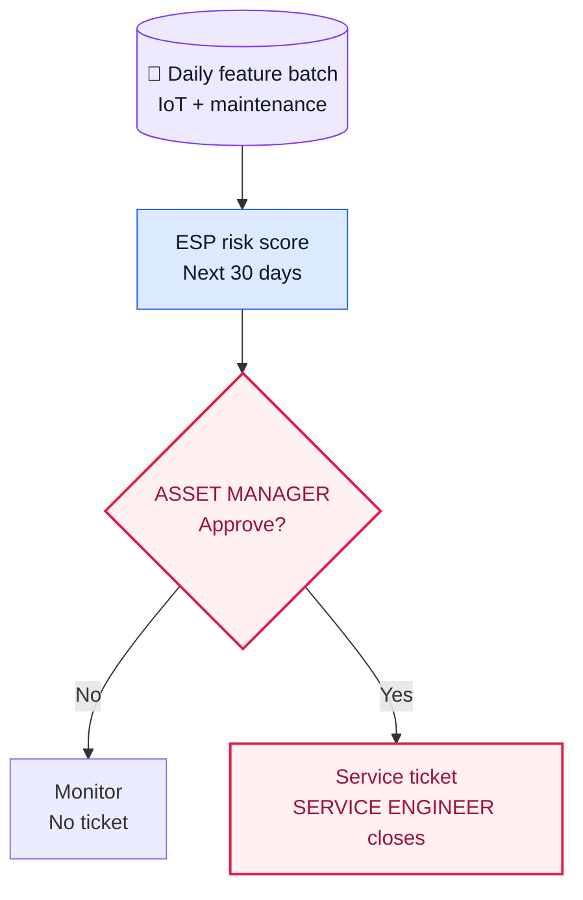
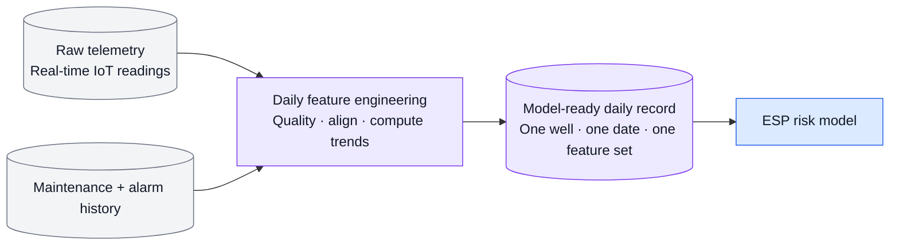

# Industrial Agentic AI POC — Operations Intelligence

**A runnable, synthetic POC for turning early ESP risk signals into a governed field-service response.**

## 1. Executive Summary

Industrial operations are a classic Industry 4.0 OT/IT transformation problem: high-volume operational telemetry lives alongside production, maintenance, and field-service information, but decisions still depend on fragmented evidence and manual coordination.

This POC demonstrates a modern AI pattern for that environment: convert raw OT signals into a governed feature set, apply a purpose-built ML model, and route the resulting evidence through a human-approved operational workflow. It is not a generic chatbot and it does not automate equipment control.

## 2. Use Case Overview — Early ESP Risk to Field Response

This use case is for **upstream oil production / extraction**, not exploration. An electric submersible pump (ESP) lifts produced fluids from a well; deteriorating pump performance can lead to avoidable production loss and an expensive field intervention.

- **Predict:** At the end of each production day, score each active ESP-lifted well for elevated 30-day ESP-related production-loss or intervention risk.
- **Decide:** Give the Asset Manager the score and supporting signals for review; the model does not diagnose root cause or control equipment.
- **Respond:** Only an approved inspection creates a field-service ticket. The Service Engineer closes the ticket with the field outcome, which becomes evaluation evidence.

## 3. Data Gathering and Feature Engineering

The model does **not** receive raw IoT messages. Telemetry arrives continuously, but a daily feature job applies quality checks and computes a governed feature record for each well using the latest 7-day and 30-day operating history.

### What the data looks like

| Real-time raw telemetry | Daily model-ready feature record |
|---|---|
| `10:05 · WELL-024 · motor_current_a · 61.8` | `WELL-024 · 2026-07-15 · motor_current_cv_7d_pct: 10.5` |
| `10:10 · WELL-024 · oil_rate_bpd · 420` | `oil_rate_decline_30d_pct: 19.2` |
| `10:15 · WELL-024 · intake_pressure_psi · 920` | `intake_pressure_decline_30d_pct: 14.8` |
| `Alarm event · WELL-024 · timestamp` | `alarm_count_30d: 4` |
| `Maintenance event · WELL-024 · close date` | `days_since_last_intervention: 418` |

The left side is a stream of narrow events. The right side is the single daily input record used by the prediction model: it turns current levels, recent variability, longer-term trends, alarms, and maintenance context into a coherent decision input.

For model development, the POC uses synthetic historical daily records with a chronological train / validation / test split. For daily scoring, the record is unlabeled because the next 30-day outcome has not happened yet.

## 4. Machine Learning Approach

This is a supervised classification problem: predict whether a well has elevated risk of an ESP-related intervention or material production-loss event in the next 30 days. The lab compares an operating-rule baseline, logistic regression, and gradient-boosted trees; validation selects the model and threshold, and a held-out test set evaluates the final candidate.

The output is a risk score, tier, and visible supporting signals—not a root-cause diagnosis. [See the runnable ML Lab.](ml/README.md)

## 5. End-to-End Solution Workflow

The model is only the first step. The workflow preserves the same `case_id` through scoring, human approval, synthetic ticket creation, field closure, and evaluation. The formal skills define each handoff; the local state-machine runner makes the workflow repeatable for both high-risk and healthy cases.

- [Workflow implementation and skill mapping](WORKFLOW.md)
- [Runnable workflow state machine](src/workflow_runner.py)

## POC boundary

All data, scores, tickets, approvals, and field outcomes are synthetic. This POC does not connect to live OT equipment or a CMMS, dispatch technicians, purchase equipment, change operating settings, or make safety decisions.

The broader upstream trial scope and assumptions are in [`trial-scope/`](trial-scope/README.md). Use-case selection and client-specific economic impact belong in a separate customer trial-scoping deck, not in this reusable POC.
