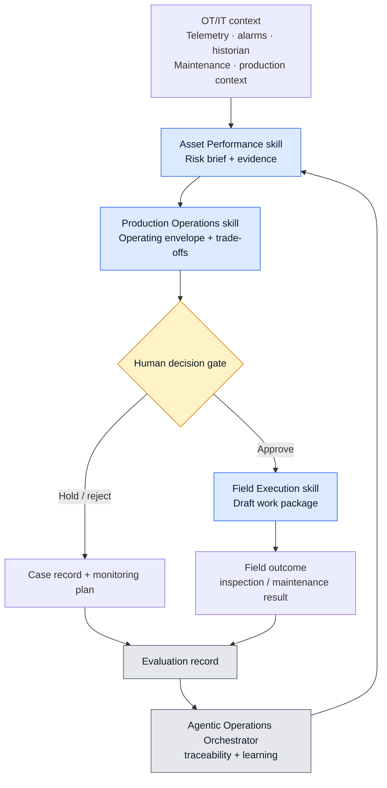

# Industrial Agentic AI POC — Operations Intelligence

**OT/IT data context, asset performance, process and energy decision support, and field execution.**

This runnable in-silico POC shows how a single industrial signal becomes an evidence-backed, human-approved field response. It uses static synthetic data only. It does **not** connect to live equipment, control equipment, change process setpoints, dispatch technicians, create production work orders, or make safety decisions.

## 1. The operational question

In upstream production, an ESP-related failure can turn a gradual change in well performance into unplanned production deferral and an expensive field intervention. Production teams need an earlier, evidence-backed way to decide which wells require attention, what evidence supports the concern, and whether an inspection should be approved.

This POC focuses on that decision. It combines production telemetry, ESP operating signals, maintenance history, and operating constraints into a well-risk assessment. A supervised ML model can rank the likelihood of near-term ESP-related failure or material production loss; the surrounding workflow presents the evidence to a production engineer, preserves a human approval gate, and prepares a draft field response only when approved.

The intended outcome is not autonomous control. It is earlier prioritization of high-risk wells, fewer avoidable production-deferral days, and a measurable basis for comparing the cost of intervention with the cost of inaction.

The project also provides a foundation for related operational use cases, including production optimization, work-order prioritization, energy optimization, and emissions anomaly detection. The supporting trial-scoping materials are maintained in [`trial-scope/`](trial-scope/README.md).

## 2. The story: one oil-well event, one operational loop

An upstream oil field monitors an oil well using an electric submersible pump (ESP), a common artificial-lift system. The well's oil rate is declining while motor-current and intake-pressure signals become abnormal. The team needs to protect safe, stable production without ordering an unjustified intervention or workover.

1. **Asset performance** reviews well telemetry, intervention history, and plausible artificial-lift failure modes; it creates a risk brief rather than claiming a root cause.
2. **Production operations** checks the well's operating envelope and the production-versus-intervention trade-off; it does not alter an operating parameter.
3. **Human decision gate** lets the production engineer and operations supervisor approve, hold, or reject the recommended response.
4. **Field execution** creates a draft diagnostic or inspection package only after approval; it does not assume that a costly workover is justified.
5. **Evaluation** records the outcome so later assessments can be compared with evidence.



## 3. Skills portfolio

| Business domain | Skill | Simple responsibility | Never does |
|---|---|---|---|
| Asset performance management | [`asset-performance`](.agents/skills/asset-performance/SKILL.md) | Prioritize an emerging asset risk and assemble evidence | Claims a proven root cause or controls equipment |
| Production operations / process management | [`process-energy-optimization`](.agents/skills/process-energy-optimization/SKILL.md) | Compare the operating envelope, production, energy, and constraint trade-offs | Changes an operating parameter |
| Field service management | [`field-execution`](.agents/skills/field-execution/SKILL.md) | Draft a field-ready inspection or maintenance package after approval | Dispatches people or creates production work orders |
| Cross-domain agentic operations | [`agentic-operations-orchestrator`](.agents/skills/agentic-operations-orchestrator/SKILL.md) | Preserves case state, routes skill handoffs, enforces human approval, and records outcomes | Overrides safety or human authority |

The project-level guide is [`AGENTS.md`](AGENTS.md). The sole POC workflow contract is [`workflow.md`](.agents/skills/agentic-operations-orchestrator/workflow.md). Each reusable skill follows the formal Codex structure: `.agents/skills/<skill-name>/SKILL.md` plus `agents/openai.yaml` metadata.

## 4. POC architecture boundary

```text
PLC / sensors → SCADA, gateway, MQTT or OPC UA → historian / data platform
                                                   ↓
                           this POC: skills + orchestrator + human decision gate
                                                   ↓
                                  CMMS/EAM or field-service system (future connector)
```

The OT layer remains the trusted source for operational signals. Existing enterprise systems remain systems of record. This POC is the governed **decision-support and workflow layer** between them.

## 5. Included synthetic artifact

- [`data/sample-asset-signal.json`](data/sample-asset-signal.json) — one synthetic ESP-lifted oil-well case with production telemetry, intervention context, and operating constraints.

## 6. Runnable lab components

- [`ESP Risk Modeling Lab`](ml/README.md) — the complete supervised-ML component: decision, synthetic data, chronological train/validation/test split, model comparison, held-out results, and future FastAPI boundary.
- [`ESP Risk-to-Response Workflow`](.agents/skills/agentic-operations-orchestrator/workflow.md) — how a Codex or Claude Code agent uses the skills to call the risk model and move an approved case through operations and field execution.

## 7. What would make it production-ready

Real connectors to OT/historian and CMMS systems, identity and access controls, audit storage, evaluation datasets, observability, model/version governance, and approved safety operating procedures.

## 8. Trial-scoping deliverables

The customer-facing upstream ESP reliability trial scope, assumptions, and final submission artifacts are maintained in [`trial-scope/`](trial-scope/README.md).
