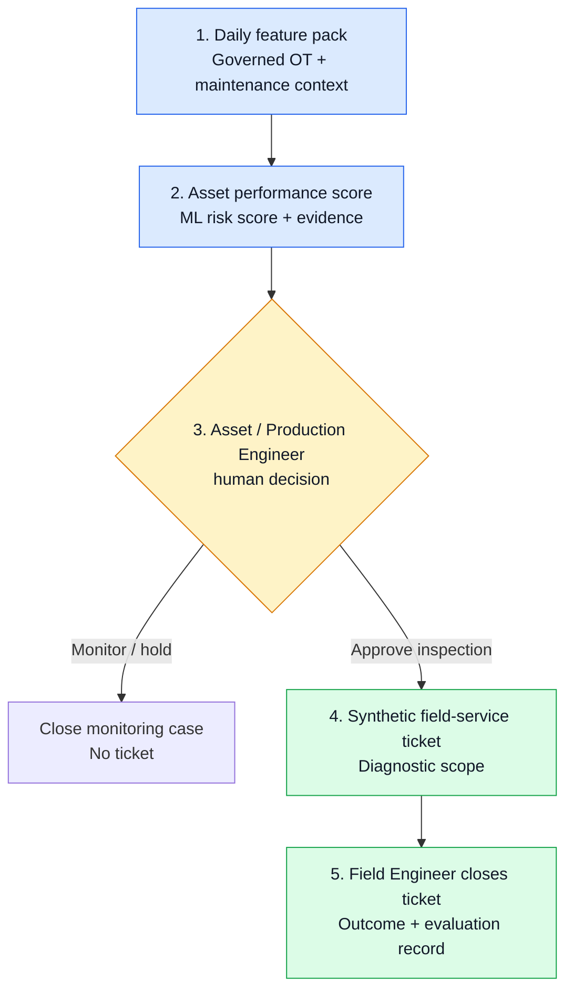

# Industrial Agentic AI POC — Operations Intelligence

**A runnable, synthetic POC for turning early ESP risk signals into a governed field-service response.**

## 30-second overview

An upstream operator scores each active ESP-lifted oil well at the end of the production day. A high-risk signal does **not** control equipment or order a replacement. It gives an Asset / Production Engineer evidence to review. Only an approved inspection creates a synthetic field ticket; the Field Engineer's outcome closes the case and becomes evaluation evidence.

## Two test scenarios

| Synthetic well | What the model finds | Workflow result |
|---|---|---|
| `WELL-025` | Stable operating pattern: `monitor` | Monitoring case closes; no ticket |
| `WELL-024` | High ESP-related production-loss risk | Engineer approval → synthetic diagnostic ticket → simulated field outcome → evaluation record |

## What is implemented

| Component | What it demonstrates | Detail |
|---|---|---|
| ESP risk model | Synthetic training, chronological train/validation/test split, local inference, and model evidence | [ML Lab](ml/README.md) |
| Governed workflow | Skills, state transitions, human approval gate, synthetic ticket lifecycle, and outcome record | [Workflow implementation](WORKFLOW.md) |
| Runnable demo | Replays the high-risk and healthy scenarios locally | [Workflow runner](src/workflow_runner.py) |

## POC boundary

All data, scores, tickets, approvals, and field outcomes are synthetic. This POC does not connect to live OT equipment or a CMMS, dispatch technicians, purchase equipment, change operating settings, or make safety decisions.

The broader upstream trial scope and assumptions are in [`trial-scope/`](trial-scope/README.md). Future portfolio capabilities—such as production optimization, work-order prioritization, energy optimization, and emissions anomaly detection—are intentionally outside this narrow runnable workflow.
