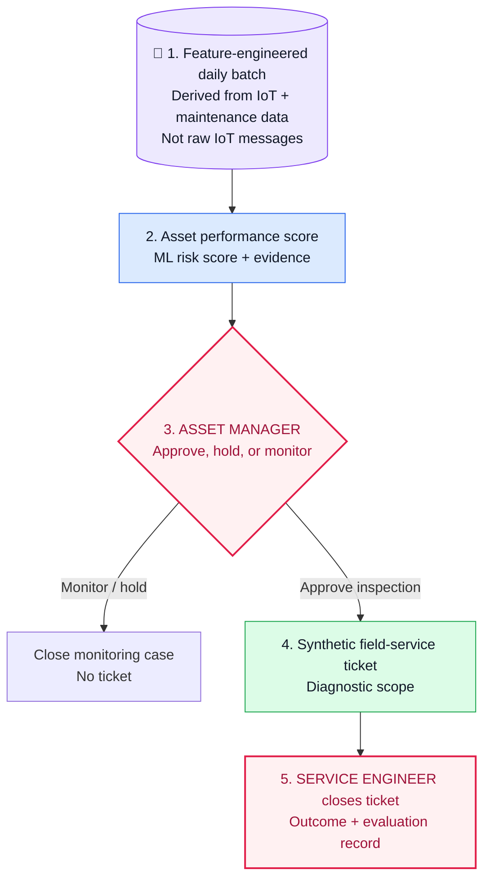

# Industrial Agentic AI POC — Operations Intelligence

**A runnable, synthetic POC for turning early ESP risk signals into a governed field-service response.**

## 1. Operational problem

In upstream oil production, an electric submersible pump (ESP) can deteriorate gradually before a material production-loss event. Teams need an earlier, evidence-backed way to decide which wells deserve attention—without letting a model control equipment or order a replacement.

## 2. Selected use case: early ESP risk to field response

At the end of each production day, the system scores each active ESP-lifted well. A high-risk signal gives the Asset Manager evidence to review. Only an approved inspection creates a synthetic field ticket; the Service Engineer's outcome closes the case and becomes evaluation evidence.

| Synthetic well | Workflow result |
|---|---|
| `WELL-025` | Stable pattern → `monitor` → case closes; no ticket |
| `WELL-024` | High risk → human approval → synthetic ticket → outcome record |

## 3. Data foundation

The model receives a governed, feature-engineered daily batch—not raw IoT messages. The input connects production trend, ESP telemetry trend, alarms, and maintenance context under one well and one observation date.

For model development, the POC uses synthetic historical data with a chronological train / validation / test split. For daily scoring, it uses an unlabeled feature pack for the active well. [See the data and ML contract.](ml/README.md#2-data-boundary-and-model-ready-feature-set)

## 4. ML solution

This is a supervised classification problem: predict whether a well has elevated risk of an ESP-related intervention or material production-loss event in the next 30 days. The lab compares an operating-rule baseline, logistic regression, and gradient-boosted trees; validation selects the model and threshold, and a held-out test set evaluates the final candidate.

The output is a risk score, tier, and visible supporting signals—not a root-cause diagnosis. [See the runnable ML Lab.](ml/README.md)

## 5. Governed workflow automation

The model is only the first step. The workflow preserves the same `case_id` through scoring, human approval, synthetic ticket creation, field closure, and evaluation. The formal skills define each handoff; the local state-machine runner makes the workflow repeatable for both high-risk and healthy cases.

- [Workflow implementation and skill mapping](WORKFLOW.md)
- [Runnable workflow state machine](src/workflow_runner.py)

## POC boundary

All data, scores, tickets, approvals, and field outcomes are synthetic. This POC does not connect to live OT equipment or a CMMS, dispatch technicians, purchase equipment, change operating settings, or make safety decisions.

The broader upstream trial scope and assumptions are in [`trial-scope/`](trial-scope/README.md). Use-case selection and client-specific economic impact belong in a separate customer trial-scoping deck, not in this reusable POC.
